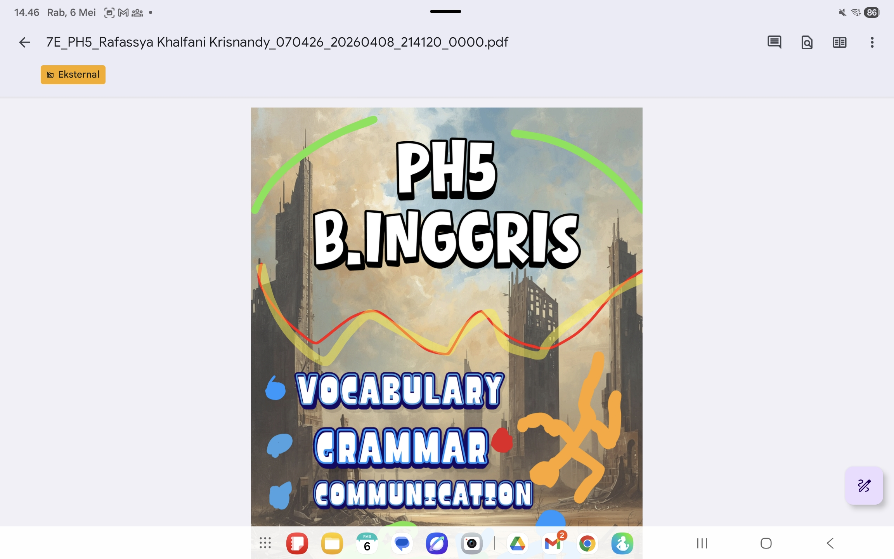

# AI Learning Integration

A practical implementation of AI tools (Gemini) to support student learning, reflection, and content creation.

---

## 🎯 Purpose

To enhance student thinking and productivity using AI as a learning partner, not a shortcut.

---

## 🧠 How It Works

Students use AI to:

- Generate ideas for writing
- Improve sentence structure
- Reflect on their learning
- Get feedback on their work

---

## 📊 Real Usage

- Used in Grade 7 classroom
- Integrated into writing and reflection tasks
- Students guided on responsible AI usage

---

## 📸 Example

---

## 🔥 Result

- Students generate ideas faster
- Improved writing clarity
- Increased confidence in expressing thoughts
- Better reflection quality

---

## ⚠️ Important Note

AI is used as a support tool, not a replacement for thinking.

Students are trained to:
- Validate AI output
- Rewrite in their own words
- Reflect critically

---

## 👤 Author

Rendi Holis  
Digital Educator & System Builder
