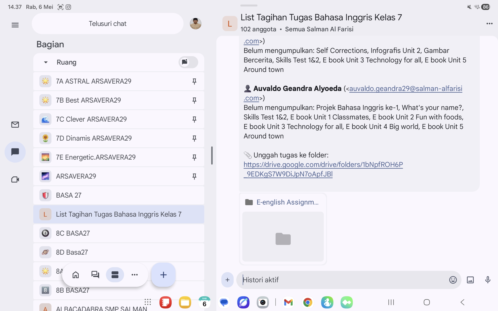

# Student Assignment Tracking System

A simple system to monitor, track, and improve student task completion.

---

## 🎯 Problem

Teachers struggle to:
- Track missing assignments
- Monitor student progress
- Maintain accountability

---

## 💡 Solution

A structured tracking system that:

- Records student submissions
- Identifies missing work
- Supports follow-up actions

---

## ⚙️ How It Works

1. Teacher inputs assignment data
2. System tracks submission status
3. Missing tasks are automatically visible
4. Teacher takes action

---

## 🛠 Tech

- Google Sheets
- Google Apps Script (optional automation)

---

## 📊 Impact

- Used with 100+ students
- Improved task completion rate
- Better communication with students

---

## 🔥 Status

Used in real classroom environment

---

## 👤 Author
---

## 📊 Real Usage

- Used in Grade 7 classroom
- Tracks 100+ students
- Monitors assignment completion

---

## 📸 Preview

---

## 🔥 Result

- Easier to detect missing assignments
- Faster teacher decision-making
- Improved student accountability

  
Rendi Holis
