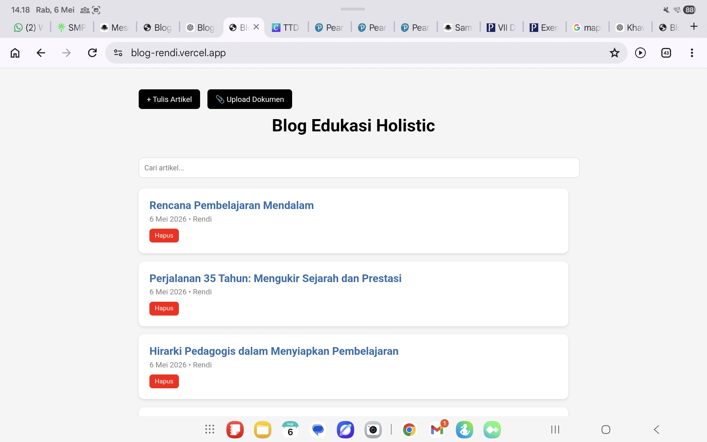

# Blog-Based Learning Platform

A simple web-based platform where students publish their learning outputs as blog posts.

---

## 🎯 Purpose

To transform students from passive learners into active creators through writing and publishing.

---

## 🚀 Features

- Students write and publish their work
- Accessible via web (no login complexity)
- Supports reflection and digital literacy
- Integrated into classroom learning

---

## 🧠 Learning Model

Task → Create → Publish → Reflect

Students are not only completing assignments, but producing real, visible outputs.

---

## 🛠 Tech

- HTML, CSS
- Deployed via Vercel

---

## 🌍 Live Demo

👉 http://blog-rendi.vercel.app

---

## 📊 Classroom Impact

- Students more motivated to complete tasks
- Writing quality improved
- Increased sense of ownership

---

## 🔥 Status

Actively used in classroom (Grade 7)

---

## 👤 Author
---

## 📸 Preview

---

## 📊 Real Usage

- Used in Grade 7 classroom
- 100+ students involved
- Weekly publishing activity

---

## 🔥 Measurable Result

- Higher assignment completion rate
- Students write more consistently
- Increased ownership of learning output
  
Rendi Holis  
Digital Educator & System Builder
